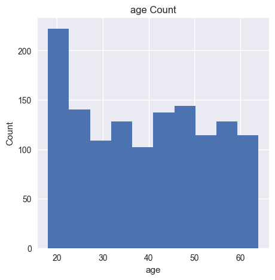
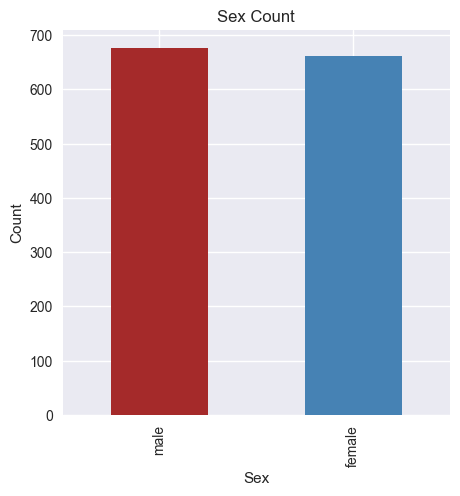
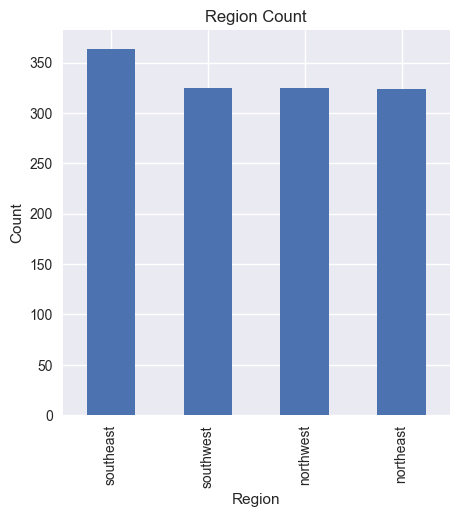
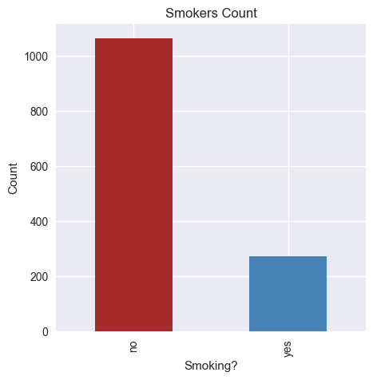
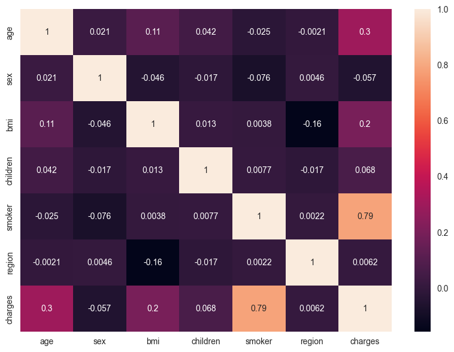

## Individual medical costs billed by health insurance Predictor
### Packages used
1. pandas
1. numpy
1. seaborn
1. matplotlib
1. sklearn

### Problem Defintion
    regression is a statistical method that models the relationship between a dependent variable and one or more independent variables. In this case, the dependent variable is the medical cost billed by health insurance, and the independent variables could be age, gender, BMI, smoking habit, number of children, etc.

   
### Our Data
    Our dataset contains information about individuals including their age, sex, BMI, number of children, smoking status, region of residence, and medical costs billed by health insurance. The dataset can be used to train a linear regression model to predict medical costs based on the other features.

### Evaluation
    We evaluate our model by comparing our predicted cost with the real cost and seeing how close they are.
### Data Visualization
#### Age Distribution

#### Gender Distribution

#### Region Distribution

#### Smokers Distribution

### Features Selection
    To select features to use we have to see how features affect the target variable by using correlation matrix

    as we see **age, bmi and smokers** are the most effective features so we will use them

### Output

| method | age | bmi | smoker | charges |
| ------ | --- | --- | ------ | ------- |
| Real Value | 31 | 25.74 | No | 3756.621 |
| Scikit-learn | 31 | 25.74 | No | 4736.743 |
| form scratch implementation | 31 | 25.74 | No | 10870.325 |

